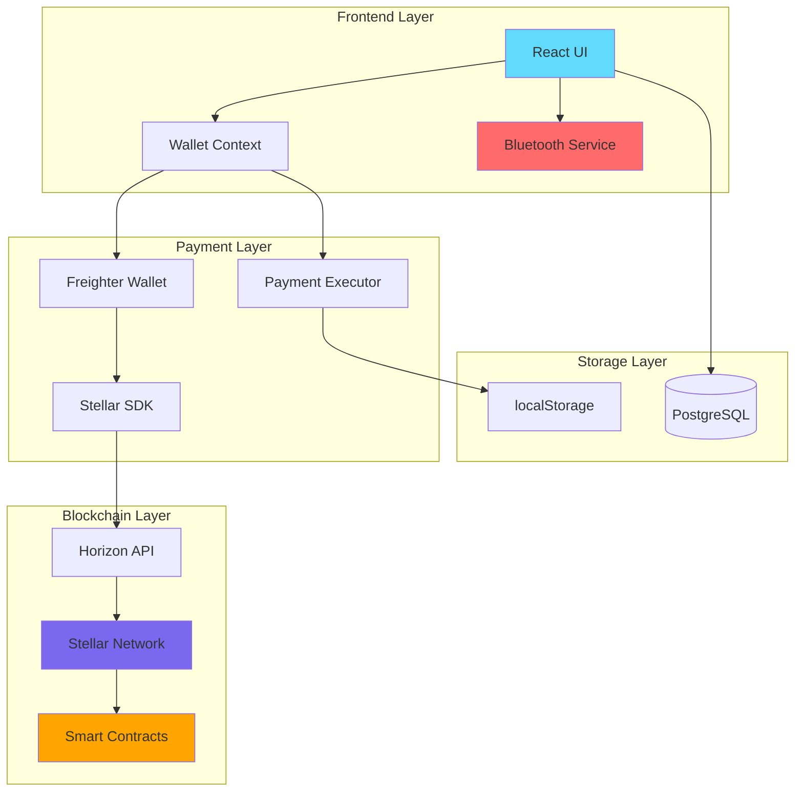
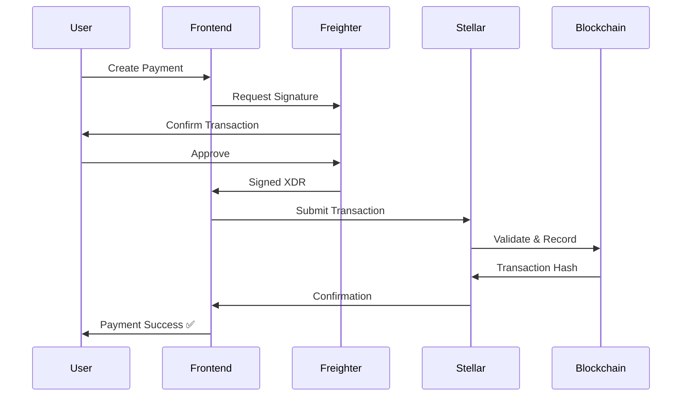
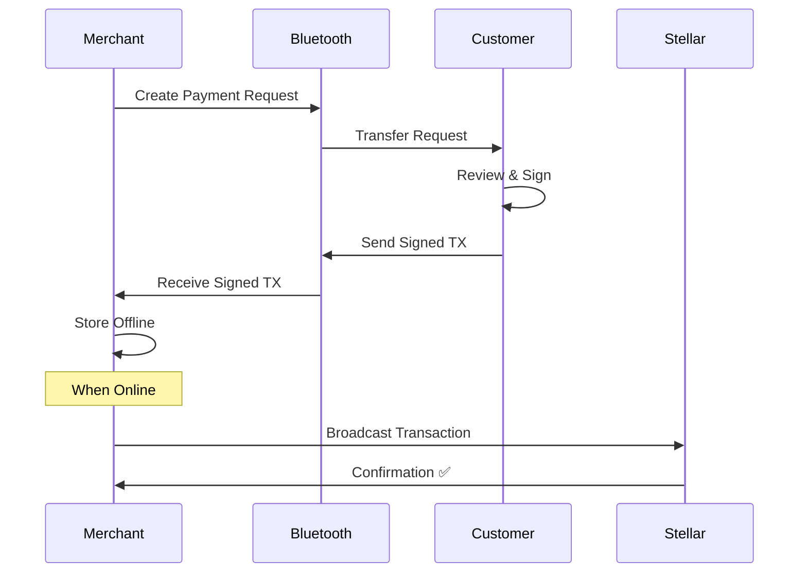

# Nexar - Next-Gen Stellar Payments

<div align="center">


**AI-Powered Payment Infrastructure with Revolutionary Offline Capabilities**

[](https://stellar.org)
[](LICENSE)
[](https://www.typescriptlang.org/)
[](https://reactjs.org/)
[](https://soroban.stellar.org/)

[Live Demo](https://nexar.vercel.app) • [Documentation](./docs) • [Report Bug](https://github.com/rohitjadhav07/Nexar/issues) • [Request Feature](https://github.com/rohitjadhav07/Nexar/issues)

</div>

---

## 🌟 What is Nexar?

Nexar is a revolutionary payment infrastructure built on Stellar blockchain that combines:
- 💳 **Real On-Chain Payments** - 100% Stellar blockchain transactions
- 📡 **Offline Bluetooth Payments** - World's first device-to-device crypto payments
- 🤖 **AI Payment Assistant** - Natural language payment commands
- ⏰ **Auto-Executing Schedules** - Set it and forget it recurring payments
- 📄 **Public Invoice System** - Shareable payment links with QR codes

---

## 📸 Screenshots

<div align="center">

### Dashboard

*Clean, modern interface with real-time balance updates*

### Bluetooth Payments

*Revolutionary offline device-to-device payments*

### Invoice System

*Create shareable payment links with QR codes*

### Analytics

*Real-time transaction insights from Stellar blockchain*

</div>

---

## 🚀 Key Features

### 💳 Real On-Chain Payments
- **100% Stellar Blockchain** - Every payment is a real transaction
- **Freighter Wallet Integration** - Secure transaction signing
- **Multi-Asset Support** - XLM, USDC, and custom Stellar assets
- **Transaction Verification** - All payments verifiable on Stellar Explorer

### 📡 Bluetooth Offline Payments (Revolutionary!)
- **Works Completely Offline** - No internet required
- **Device-to-Device Transfer** - Direct peer-to-peer via Bluetooth
- **Offline Queue System** - Broadcasts when back online
- **Perfect for Events** - Markets, festivals, remote locations

### 📄 Public Invoice System
- **Shareable Payment Links** - Unique URL for each invoice
- **QR Code Generation** - Mobile-friendly payment scanning
- **Public Payment Pages** - Anyone can pay without login
- **Real-time Status** - Track pending/paid/expired invoices

### ⏰ Auto-Executing Scheduled Payments
- **Background Executor** - Monitors and executes automatically
- **Flexible Scheduling** - Once, daily, weekly, monthly, yearly
- **Retry Logic** - Handles failures gracefully
- **Real-time Notifications** - Toast alerts for execution

### 🤖 AI Payment Assistant
- **Natural Language** - "Send 50 USDC to @alice for design work"
- **Smart Parsing** - Powered by GPT-4
- **Quick Actions** - Request, schedule, and refund via chat

### 📊 Analytics & Insights
- **Transaction History** - Complete on-chain log
- **Payment Analytics** - Volume, success rate, trends
- **Real-time Data** - Fetched from Stellar Horizon API

### 👥 Social Features
- **Friends Management** - Save frequent recipients
- **Payment Groups** - Split bills and group expenses
- **Group Chat Integration** - Coordinate payments

---

## 🏗️ Architecture

### High-Level Architecture



### Payment Flow Architecture



### Bluetooth Payment Flow



### Technology Stack

```
┌─────────────────────────────────────────────────────────┐
│                     Frontend Layer                       │
│  React 18 • TypeScript • Vite • TailwindCSS            │
│  React Query • React Router • Heroicons                 │
└─────────────────────────────────────────────────────────┘
                            │
┌─────────────────────────────────────────────────────────┐
│                   Integration Layer                      │
│  Stellar SDK • Freighter API • Web Bluetooth API        │
│  QRCode • jsPDF • html2canvas                           │
└─────────────────────────────────────────────────────────┘
                            │
┌─────────────────────────────────────────────────────────┐
│                   Blockchain Layer                       │
│  Stellar Testnet • Horizon API • Soroban Contracts      │
│  XLM • USDC • Custom Assets                             │
└─────────────────────────────────────────────────────────┘
                            │
┌─────────────────────────────────────────────────────────┐
│                    Storage Layer                         │
│  localStorage (MVP) • PostgreSQL (Production Ready)     │
│  Prisma ORM • Real-time Sync                            │
└─────────────────────────────────────────────────────────┘
```

---

## 🚀 Quick Start

### Prerequisites

```bash
# Required
- Node.js 18+ and npm
- Freighter Wallet browser extension
- Stellar testnet account with XLM

# Optional
- Rust and Cargo (for smart contracts)
- PostgreSQL (for production backend)
```

### Installation

```bash
# 1. Clone the repository
git clone https://github.com/rohitjadhav07/Nexar.git
cd Nexar

# 2. Install frontend dependencies
cd frontend
npm install

# 3. Create environment file
cp .env.example .env

# 4. Start development server
npm run dev

# 5. Open in browser
# http://localhost:5173
```

### Environment Variables

Create `frontend/.env`:

```env
VITE_STELLAR_NETWORK=testnet
VITE_STELLAR_HORIZON_URL=https://horizon-testnet.stellar.org
VITE_OPENAI_API_KEY=your_openai_key_here  # Optional for AI features
```

### Get Testnet XLM

1. Visit [Stellar Laboratory](https://laboratory.stellar.org/#account-creator)
2. Create account and fund with test XLM
3. Or use [Friendbot](https://friendbot.stellar.org)

---

## 📋 Usage Examples

### 1. Create and Share Invoice

```typescript
// Create invoice
const invoice = invoiceService.createInvoice(
  wallet.publicKey,
  100,
  'XLM',
  'Website design services',
  24 // expires in 24 hours
)

// Generate QR code
const qrCode = await invoiceService.generateQRCode(invoice)

// Share link
console.log(invoice.shareableLink)
// Output: https://nexar.vercel.app/pay/inv_1730556789_abc123
```

### 2. Schedule Recurring Payment

```typescript
// Create monthly subscription
const schedule = scheduleService.createSchedule(
  wallet.publicKey,
  'GXYZ...', // recipient
  50,
  'XLM',
  'Monthly subscription',
  'monthly',
  new Date(), // start now
  undefined, // no end date
  12 // max 12 payments
)

// Payment executor automatically handles execution
```

### 3. Bluetooth Offline Payment

```typescript
// Merchant: Send payment request
await bluetoothPaymentService.connect()
await bluetoothPaymentService.sendPaymentRequest({
  amount: 25,
  currency: 'XLM',
  description: 'Coffee'
})

// Customer: Receive and sign
const request = await bluetoothPaymentService.receivePaymentRequest()
const signedTx = await signTransaction(request)
await bluetoothPaymentService.sendSignedTransaction(signedTx)

// Broadcast when online
await bluetoothPaymentService.broadcastOfflineTransactions()
```

### 4. Execute Real Payment

```typescript
// Build and submit Stellar transaction
const txHash = await sendPayment({
  from: wallet.publicKey,
  to: recipient,
  amount: '10',
  asset: 'XLM'
})

// Verify on Stellar Explorer
// https://stellar.expert/explorer/testnet/tx/{txHash}
```

---

## 📊 Project Structure

```
nexar/
├── frontend/                    # React frontend application
│   ├── src/
│   │   ├── components/         # Reusable UI components
│   │   │   ├── Layout.tsx
│   │   │   ├── WalletButton.tsx
│   │   │   ├── Toast.tsx
│   │   │   └── ...
│   │   ├── contexts/           # React contexts
│   │   │   ├── WalletContext.tsx
│   │   │   └── CommandContext.tsx
│   │   ├── pages/              # Page components
│   │   │   ├── Dashboard.tsx
│   │   │   ├── Invoices.tsx
│   │   │   ├── Schedules.tsx
│   │   │   ├── BluetoothPayment.tsx
│   │   │   ├── Analytics.tsx
│   │   │   ├── Social.tsx
│   │   │   └── PayInvoice.tsx
│   │   ├── services/           # Business logic
│   │   │   ├── InvoiceService.ts
│   │   │   ├── ScheduleService.ts
│   │   │   ├── PaymentExecutor.ts
│   │   │   ├── BluetoothPaymentService.ts
│   │   │   └── NotificationService.ts
│   │   ├── utils/              # Utility functions
│   │   │   ├── stellarTransactions.ts
│   │   │   └── groupPayments.ts
│   │   └── types.ts            # TypeScript types
│   ├── public/
│   └── package.json
├── contracts/                   # Soroban smart contracts (Rust)
│   ├── stellar_agent_pay/
│   ├── multi_asset_router/
│   └── social_pay/
├── ai-agent/                    # AI payment assistant
│   ├── src/
│   │   ├── paymentAgent.ts
│   │   ├── commandParser.ts
│   │   └── stellarClient.ts
│   └── package.json
├── api/                         # Backend API (optional)
│   ├── prisma/
│   │   └── schema.prisma       # Database schema
│   └── package.json
├── docs/                        # Documentation
│   ├── images/                 # Screenshots
│   ├── DEPLOYMENT.md
│   ├── BLUETOOTH_PAYMENTS.md
│   └── API.md
└── README.md
```

---

## 🔧 Configuration

### Stellar Network

```typescript
// Testnet (Development)
HORIZON_URL = 'https://horizon-testnet.stellar.org'
NETWORK_PASSPHRASE = 'Test SDF Network ; September 2015'

// Mainnet (Production)
HORIZON_URL = 'https://horizon.stellar.org'
NETWORK_PASSPHRASE = 'Public Global Stellar Network ; September 2015'
```

### Contract Addresses

```env
# Stellar Testnet
PAYMENT_CONTRACT_ID=CXXXXXXXXXXXXXXXXXXXXXXXXXXXXXXXXXXXXXXXXXXXXXXXXXXXXXXX
ROUTER_CONTRACT_ID=CXXXXXXXXXXXXXXXXXXXXXXXXXXXXXXXXXXXXXXXXXXXXXXXXXXXXXXX
ADMIN_ADDRESS=GBDJ5ILN5KWNHZX75BRZ2IJSDM3MIWL7TX7HMMBUXW5FNB4FI57XHWED
```

---

## 🧪 Testing

### Test Real Payments

```bash
# 1. Get testnet XLM
Visit: https://laboratory.stellar.org/#account-creator

# 2. Create test invoice
- Amount: 10 XLM
- Description: "Test Payment"
- Copy payment link

# 3. Pay from different wallet
- Open link in incognito
- Connect different Freighter account
- Execute payment
- Verify on Stellar Explorer

# 4. Test auto-execution
- Create schedule with start time = now + 1 minute
- Open browser console
- Watch for executor logs
- Payment executes automatically!
```

### Test Bluetooth Payments

```bash
# Requirements
- Two devices with Chrome/Edge/Opera
- Bluetooth enabled on both
- Freighter wallet on both

# Steps
1. Device A: Go to /bluetooth
2. Device A: Click "Connect Device"
3. Device B: Go to /bluetooth
4. Device B: Click "Connect Device"
5. Pair devices
6. Device A: Select "Request Payment"
7. Device A: Enter amount and send
8. Device B: Select "Make Payment"
9. Device B: Wait for request
10. Device B: Sign and send
11. Device A: Broadcast when online
12. Verify on Stellar Explorer
```

### Verify on Blockchain

Every transaction can be verified:
```
https://stellar.expert/explorer/testnet/tx/{transaction_hash}
```

---

## 🚢 Deployment

### Frontend (Vercel)

```bash
# 1. Install Vercel CLI
npm install -g vercel

# 2. Deploy
cd frontend
vercel --prod

# 3. Add environment variables in Vercel dashboard
VITE_STELLAR_NETWORK=testnet
VITE_STELLAR_HORIZON_URL=https://horizon-testnet.stellar.org
```

### Smart Contracts (Stellar)

```bash
# 1. Build contracts
cd contracts/stellar_agent_pay
cargo build --target wasm32-unknown-unknown --release

# 2. Optimize WASM
stellar contract optimize \
  --wasm target/wasm32-unknown-unknown/release/stellar_agent_pay.wasm

# 3. Deploy to testnet
stellar contract deploy \
  --wasm target/wasm32-unknown-unknown/release/stellar_agent_pay.wasm \
  --source YOUR_SECRET_KEY \
  --network testnet
```

### Database (Optional - Supabase)

```bash
# 1. Create Supabase project
# 2. Copy database URL
# 3. Update .env
DATABASE_URL=postgresql://...

# 4. Run migrations
cd api
npx prisma migrate deploy
```

---

## 📚 Documentation

- [Deployment Guide](./DEPLOYMENT.md)
- [Bluetooth Payments](./BLUETOOTH_PAYMENTS.md)
- [API Documentation](./docs/API.md)
- [Smart Contracts](./contracts/README.md)
- [Contributing Guide](./CONTRIBUTING.md)

---

## 🤝 Contributing

Contributions are welcome! Please read [CONTRIBUTING.md](CONTRIBUTING.md) for details.

### Development Workflow

```bash
# 1. Fork the repository
# 2. Create feature branch
git checkout -b feature/amazing-feature

# 3. Make changes and commit
git commit -m 'Add amazing feature'

# 4. Push to branch
git push origin feature/amazing-feature

# 5. Open Pull Request
```

---

## 🔐 Security

### Wallet Security
- ✅ Private keys never stored on servers
- ✅ Freighter wallet for secure signing
- ✅ Multi-signature support ready
- ✅ Session management with JWT

### Smart Contract Security
- ✅ Access controls implemented
- ✅ Reentrancy protection
- ✅ Safe math operations
- ✅ Audit trail on blockchain

### Bluetooth Security
- ✅ Private keys never shared
- ✅ Only signed transactions transferred
- ✅ Bluetooth pairing required
- ✅ Transaction validation before broadcast

---

## 🌟 Use Cases

### 1. Street Markets & Vendors
- Accept payments without internet
- Perfect for outdoor markets
- Broadcast at end of day

### 2. Music Festivals & Events
- Crowded areas with poor connectivity
- Fast peer-to-peer payments
- No network congestion

### 3. Remote Locations
- Rural areas without internet
- Camping, hiking, outdoor events
- Emergency situations

### 4. E-commerce & Online Stores
- Shareable invoice links
- QR code payments
- Automated recurring billing

### 5. Freelancers & Contractors
- Easy payment requests
- Scheduled invoices
- Professional receipts

---

## 📈 Roadmap

- [x] Real on-chain Stellar payments
- [x] Public invoice system with QR codes
- [x] Auto-executing scheduled payments
- [x] Bluetooth offline payments
- [x] Analytics dashboard
- [x] Social features (Friends & Groups)
- [ ] Deploy smart contracts to mainnet
- [ ] Backend API for multi-device sync
- [ ] Multi-signature wallets
- [ ] Mobile app (React Native)
- [ ] NFC tap-to-pay
- [ ] Advanced analytics
- [ ] Payment request templates
- [ ] Webhook notifications
- [ ] Multi-language support

---

## 📊 Performance

### Metrics

- **Payment Speed**: < 5 seconds (on-chain)
- **Bluetooth Transfer**: < 1 second
- **Invoice Generation**: < 100ms
- **QR Code Creation**: < 200ms
- **Auto-Execution Check**: Every 60 seconds

### Scalability

- **Concurrent Users**: Unlimited (blockchain-based)
- **Transactions/Second**: Limited by Stellar network (~1000 TPS)
- **Offline Queue**: Unlimited (localStorage)
- **Bluetooth Range**: ~10 meters

---

## 🆘 Support

### Common Issues

**"Account not found"**
- Fund your testnet account at https://laboratory.stellar.org/#account-creator

**"Transaction failed"**
- Ensure you have enough XLM (need ~1 XLM for fees)

**"Freighter not detected"**
- Install Freighter: https://www.freighter.app/

**"Bluetooth not supported"**
- Use Chrome, Edge, or Opera browser
- Enable Bluetooth on your device

### Get Help

- 📧 Email: support@nexar.app
- 💬 Discord: [Join our community](https://discord.gg/nexar)
- 🐛 Issues: [GitHub Issues](https://github.com/rohitjadhav07/Nexar/issues)
- 📖 Docs: [Documentation](./docs)

---

## 📝 License

This project is licensed under the MIT License - see the [LICENSE](LICENSE) file for details.

---

## 🙏 Acknowledgments

- Built with [Scaffold Stellar](https://github.com/stellar/scaffold-soroban)
- Powered by [Stellar](https://stellar.org) blockchain
- UI inspired by modern fintech applications
- AI capabilities via OpenAI GPT-4
- Bluetooth implementation using Web Bluetooth API

---

## 🔗 Links

- **Live Demo**: https://nexar.vercel.app
- **GitHub**: https://github.com/rohitjadhav07/Nexar
- **Stellar Testnet Explorer**: https://stellar.expert/explorer/testnet
- **Freighter Wallet**: https://www.freighter.app/
- **Stellar Documentation**: https://developers.stellar.org/
- **Soroban Documentation**: https://soroban.stellar.org/

---

## 📞 Contact

**Rohit Jadhav**
- GitHub: [@rohitjadhav07](https://github.com/rohitjadhav07)
- Email: rohit@nexar.app
- Twitter: [@rohitjadhav07](https://twitter.com/rohitjadhav07)

---

<div align="center">

**Built with ❤️ for the Stellar ecosystem**

*Nexar - Making crypto payments as easy as sending a text message*

⭐ Star us on GitHub if you find this project useful!

</div>
