# Nexar - Next-Gen AI-Powered Stellar Payments

<div align="center">


**Intelligent Payment Infrastructure Built on Stellar Blockchain**

[](https://stellar.org)
[](https://www.typescriptlang.org/)
[](https://reactjs.org/)
[](LICENSE)

[Live Demo](https://nexar.vercel.app) • [Documentation](#documentation) • [API Docs](#api-reference)

</div>

---

## 📋 Table of Contents

- [Overview](#overview)
- [Key Features](#key-features)
- [Architecture](#architecture)
- [Technology Stack](#technology-stack)
- [Getting Started](#getting-started)
- [Deployment](#deployment)
- [API Reference](#api-reference)
- [Contributing](#contributing)
- [License](#license)

---

## 🌟 Overview

Nexar is a revolutionary payment platform that combines the power of Stellar blockchain with artificial intelligence to create an intuitive, natural language payment experience. Built for the modern web, Nexar makes crypto payments as simple as sending a text message.

### Why Nexar?

- 🤖 **AI-Powered Commands** - Natural language processing for payment operations
- ⚡ **Real-Time Execution** - Instant on-chain transactions via Stellar
- 📄 **Smart Invoicing** - Shareable payment links with QR codes
- ⏰ **Auto-Scheduling** - Set-and-forget recurring payments
- 👥 **Social Payments** - Groups, friends, and split bills
- 📊 **Analytics Dashboard** - Real-time insights from blockchain data

---

## 🎯 Key Features

### 1. AI Payment Assistant
```
User: "Send 50 USDC to @alice for design work"
AI: ✅ Processing payment... [Transaction executed]
```
- Natural language command parsing
- Powered by Google Gemini AI
- Context-aware responses
- Multi-step transaction handling

### 2. Public Invoice System
- Generate shareable payment links
- QR code generation for mobile payments
- Real-time payment status tracking
- Expiration management

### 3. Scheduled Payments
- Recurring payment automation
- Background execution engine
- Flexible scheduling (daily, weekly, monthly)
- Automatic retry logic

### 4. Social Features
- Friend management system
- Payment groups
- Split bill functionality
- Group expense tracking

### 5. Analytics & Insights
- Transaction history
- Payment volume tracking
- Success rate monitoring
- Export capabilities (CSV, PDF)

---

## 🏗️ Architecture

### System Architecture


### Payment Flow


### Invoice Payment Flow


### Scheduled Payment Flow

```mermaid
sequenceDiagram
    participant User
    participant Frontend
    participant Executor
    participant Stellar
    
    User->>Frontend: Create Schedule
    Frontend->>Frontend: Store in LocalStorage
    loop Every 60 seconds
        Executor->>Executor: Check Due Payments
        alt Payment Due
            Executor->>User: Request Signature
            User->>Executor: Approve
            Executor->>Stellar: Submit Transaction
            Stellar->>Executor: Confirmation
            Executor->>Frontend: Update Status
            Frontend->>User: 🔔 Payment Executed
        end
    end
```



---

## 🛠️ Technology Stack

### Frontend
```
├── React 18              # UI Framework
├── TypeScript 5          # Type Safety
├── Vite                  # Build Tool
├── TailwindCSS           # Styling
├── React Query           # Data Fetching
├── React Router          # Navigation
├── Framer Motion         # Animations (removed for simplicity)
├── Axios                 # HTTP Client
└── Stellar SDK           # Blockchain Integration
```

### Backend (AI Agent)
```
├── Node.js 18+           # Runtime
├── Express               # Web Framework
├── TypeScript            # Type Safety
├── LangChain             # AI Framework
├── Google Gemini         # AI Model
├── Stellar SDK           # Blockchain Client
└── Zod                   # Schema Validation
```

### Blockchain
```
├── Stellar Network       # Layer 1 Blockchain
├── Soroban               # Smart Contracts
├── Horizon API           # REST API
├── Freighter Wallet      # Browser Extension
└── XLM/USDC              # Native Assets
```

### DevOps
```
├── Vercel                # Frontend Hosting
├── Render                # Backend Hosting
├── GitHub Actions        # CI/CD
└── Docker                # Containerization
```

---

## 🚀 Getting Started

### Prerequisites

```bash
# Required
- Node.js 18+ and npm
- Freighter Wallet browser extension
- Stellar testnet account with XLM

# Optional
- Docker (for containerized deployment)
- PostgreSQL (for production backend)
```

### Installation

```bash
# 1. Clone the repository
git clone https://github.com/rohitjadhav07/Nexar.git
cd Nexar

# 2. Install frontend dependencies
cd frontend
npm install

# 3. Configure environment
cp .env.example .env
# Edit .env with your configuration

# 4. Start development server
npm run dev

# 5. Open browser
# http://localhost:5173
```

### Environment Configuration

Create `frontend/.env`:

```env
# Stellar Network
VITE_STELLAR_NETWORK=testnet
VITE_STELLAR_HORIZON_URL=https://horizon-testnet.stellar.org

# AI Agent (use deployed URL or localhost)
VITE_AI_AGENT_URL=https://nexar-8gu2.onrender.com

# Contract Addresses (optional)
VITE_PAYMENT_CONTRACT_ID=your_contract_id
VITE_ROUTER_CONTRACT_ID=your_router_id
```

### Get Testnet XLM

1. Visit [Stellar Laboratory](https://laboratory.stellar.org/#account-creator)
2. Create account and fund with test XLM
3. Or use [Friendbot](https://friendbot.stellar.org)

---

## 📦 Deployment

### Frontend (Vercel)

```bash
# 1. Install Vercel CLI
npm install -g vercel

# 2. Deploy
cd frontend
vercel --prod

# 3. Set environment variables in Vercel dashboard
```

### Backend (Render)

1. Go to [Render Dashboard](https://dashboard.render.com/)
2. New Web Service → Connect GitHub
3. Configure:
   - Root Directory: `ai-agent`
   - Build: `npm install && npm run build`
   - Start: `npm start`
4. Add environment variables:
   ```
   GEMINI_API_KEY=your_key
   STELLAR_HORIZON_URL=https://horizon-testnet.stellar.org
   STELLAR_NETWORK=testnet
   ```

📖 **Full deployment guide**: [DEPLOY_CHECKLIST.md](./DEPLOY_CHECKLIST.md)

---

## 📚 API Reference

### AI Agent Endpoints

#### Health Check
```http
GET /health
```

**Response:**
```json
{
  "status": "healthy",
  "timestamp": "2024-01-01T00:00:00.000Z"
}
```

#### Process Command
```http
POST /api/command
Content-Type: application/json

{
  "command": "Send 50 USDC to @alice for design work",
  "userPublicKey": "GXYZ..."
}
```

**Response:**
```json
{
  "success": true,
  "message": "Payment request created",
  "data": {
    "intent": "request",
    "amount": 50,
    "currency": "USDC",
    "recipient": "@alice"
  }
}
```

#### Get Invoice Status
```http
GET /api/invoice/:invoiceId
```

**Response:**
```json
{
  "id": "inv_123",
  "amount": 100,
  "currency": "XLM",
  "status": "pending",
  "recipient": "GXYZ...",
  "createdAt": "2024-01-01T00:00:00.000Z"
}
```

---

## 📊 Project Structure

```
nexar/
├── frontend/                 # React application
│   ├── src/
│   │   ├── components/      # UI components
│   │   ├── pages/           # Page components
│   │   ├── services/        # Business logic
│   │   ├── contexts/        # React contexts
│   │   ├── utils/           # Helper functions
│   │   └── config/          # Configuration
│   └── public/              # Static assets
│
├── ai-agent/                # Backend AI service
│   ├── src/
│   │   ├── index.ts         # Entry point
│   │   ├── paymentAgent.ts  # AI agent logic
│   │   ├── commandParser.ts # NLP parser
│   │   └── stellarClient.ts # Blockchain client
│   └── Dockerfile           # Container config
│
├── contracts/               # Soroban smart contracts
│   ├── stellar_agent_pay/   # Payment contract
│   └── multi_asset_router/  # DEX router
│
├── docs/                    # Documentation
└── scripts/                 # Utility scripts
```

---

## 🧪 Testing

### Test Real Payments

```bash
# 1. Get testnet XLM
Visit: https://laboratory.stellar.org/#account-creator

# 2. Create test invoice
- Amount: 10 XLM
- Description: "Test Payment"
- Copy payment link

# 3. Pay from different wallet
- Open link in incognito
- Connect different Freighter account
- Execute payment
- Verify on Stellar Explorer
```

### Verify on Blockchain

Every transaction is verifiable:
```
https://stellar.expert/explorer/testnet/tx/{transaction_hash}
```

---

## 🔐 Security

- ✅ Private keys never stored on servers
- ✅ Freighter wallet for secure signing
- ✅ HTTPS encryption for all API calls
- ✅ CORS protection enabled
- ✅ Input validation and sanitization
- ✅ Rate limiting on API endpoints

---

## 🌟 Use Cases

### 1. E-commerce & Online Stores
- Shareable invoice links
- QR code payments
- Automated recurring billing

### 2. Freelancers & Contractors
- Easy payment requests
- Scheduled invoices
- Professional receipts

### 3. Social Payments
- Split bills with friends
- Group expense management
- Family payment coordination

### 4. Subscription Services
- Automated recurring payments
- Flexible scheduling
- Payment retry logic

---

## 📈 Roadmap

- [x] Real on-chain Stellar payments
- [x] Public invoice system with QR codes
- [x] Auto-executing scheduled payments
- [x] AI payment assistant
- [x] Analytics dashboard
- [x] Social features (Friends & Groups)
- [x] Backend deployment
- [ ] Multi-signature wallets
- [ ] Mobile app (React Native)
- [ ] Advanced analytics
- [ ] Webhook notifications
- [ ] Multi-language support
- [ ] Mainnet deployment

---

## 🤝 Contributing

Contributions are welcome! Please follow these steps:

1. Fork the repository
2. Create a feature branch (`git checkout -b feature/amazing-feature`)
3. Commit your changes (`git commit -m 'Add amazing feature'`)
4. Push to the branch (`git push origin feature/amazing-feature`)
5. Open a Pull Request

---

## 📝 License

This project is licensed under the MIT License - see the [LICENSE](LICENSE) file for details.

---

## 🙏 Acknowledgments

- Built with [Stellar](https://stellar.org) blockchain
- AI powered by [Google Gemini](https://deepmind.google/technologies/gemini/)
- UI components from [Heroicons](https://heroicons.com/)
- Hosted on [Vercel](https://vercel.com) and [Render](https://render.com)

---

## 📞 Contact & Support

**Rohit Jadhav**
- GitHub: [@rohitjadhav07](https://github.com/rohitjadhav07)
- Email: rohit@nexar.app
- Twitter: [@rohitjadhav07](https://twitter.com/rohitjadhav07)

### Get Help

- 📖 [Documentation](./docs)
- 🐛 [Report Bug](https://github.com/rohitjadhav07/Nexar/issues)
- 💡 [Request Feature](https://github.com/rohitjadhav07/Nexar/issues)
- 💬 [Discussions](https://github.com/rohitjadhav07/Nexar/discussions)

---

## 🔗 Links

- **Live Demo**: https://nexar.vercel.app
- **Backend API**: https://nexar-8gu2.onrender.com
- **GitHub**: https://github.com/rohitjadhav07/Nexar
- **Stellar Explorer**: https://stellar.expert/explorer/testnet
- **Freighter Wallet**: https://www.freighter.app/

---

<div align="center">

**Built with ❤️ for the Stellar ecosystem**

*Making crypto payments as easy as sending a text message*

⭐ Star us on GitHub if you find this project useful!

[⬆ Back to Top](#nexar---next-gen-ai-powered-stellar-payments)

</div>
